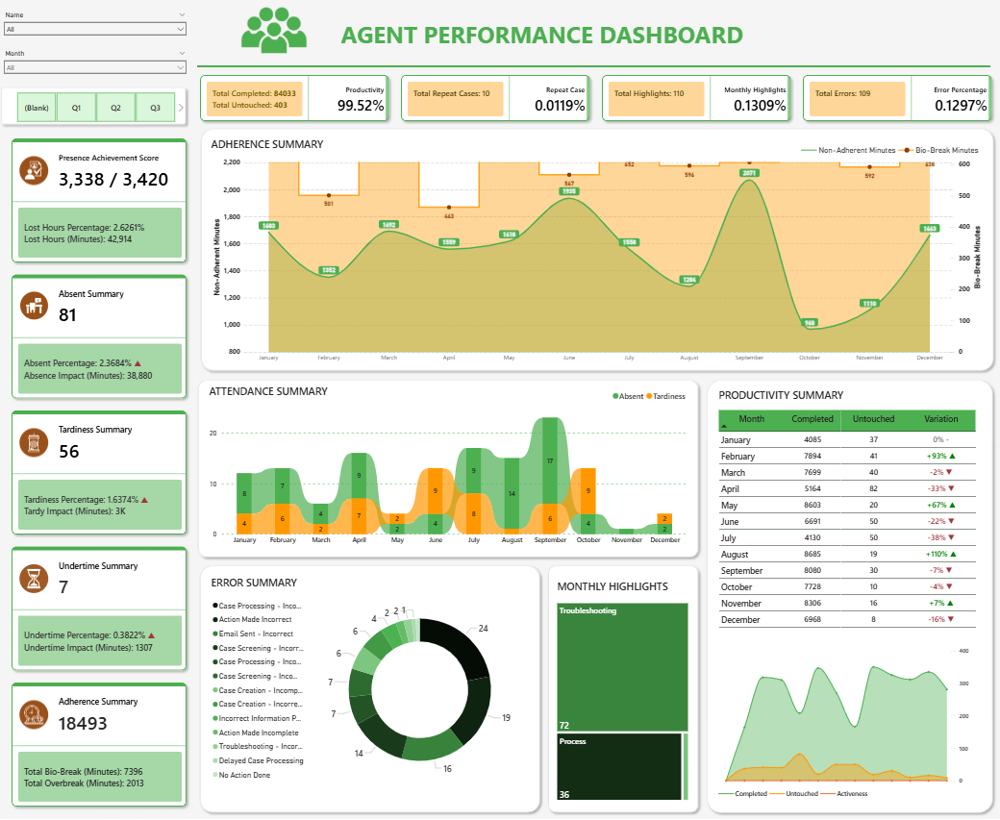

# Power-BI-Agent-Performance-Dashboard
A Power BI dashboard built to monitor agent performance and operational KPIs. This repository highlights report design, data modeling, and visualization techniques using data that has been visually anonymized for portfolio presentation.

## Information
- **Dataset:** Attendance, Adherence, Error Rate, and Productivity data 
- **Key Insights:** Adherence summary, attendance summary, error summary, productivity summary
- **Confidentiality Note:** Original report contains sensitive company data.

## Dashboards

    

## Sample

    

